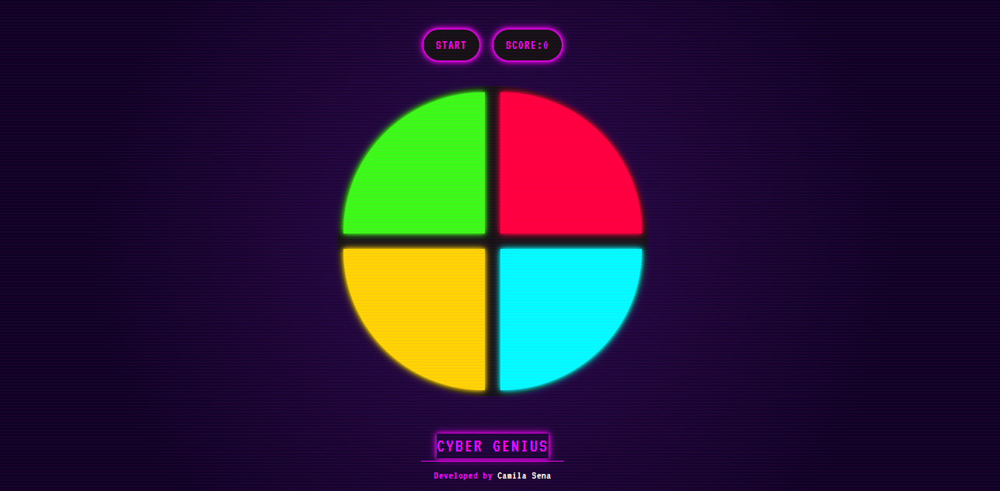

# Cyber Genius Game 🎮

Um jogo da memória estilo Genius (Simon) com tema cyberpunk desenvolvido com HTML, CSS e JavaScript.

## 📋 Sobre o Projeto

Cyber Genius é uma versão moderna e estilizada do clássico jogo da memória Genius (também conhecido como Simon). O jogo desafia a memória do jogador, que deve repetir sequências de cores cada vez mais longas, seguindo o padrão gerado aleatoriamente pelo jogo.

### 🔮 Características

- **Design Cyberpunk**: Interface futurista com cores neon e efeitos visuais impressionantes
- **Efeitos Visuais**: Animações, glitches e sombras neon que aprimoram a experiência visual
- **Sons Responsivos**: Cada cor tem seu próprio som para melhorar a experiência de jogo
- **Responsivo**: Adaptado para funcionar em diferentes tamanhos de tela
- **Feedback Visual**: Indicações claras de acertos e erros com efeitos visuais
- **Modal Game Over**: Tela estilizada que mostra sua pontuação final quando perde o jogo

## 🚀 Como Jogar

1. Abra o arquivo `index.html` em qualquer navegador web moderno
2. Clique no botão "START" para iniciar o jogo
3. Observe a sequência de cores que pisca no tabuleiro
4. Repita a sequência clicando nas cores na mesma ordem
5. A cada acerto, uma nova cor é adicionada à sequência
6. Continue até errar ou completar todas as sequências

## 💻 Tecnologias Utilizadas

- **HTML5**: Estrutura da página e elementos do jogo
- **CSS3 / Tailwind CSS**: Estilização e efeitos visuais
- **JavaScript**: Lógica do jogo e interatividade
- **Animações CSS**: Efeitos de pulsação, glitch e transições

## 🧠 Lógica do Jogo

O funcionamento do Cyber Genius segue estas regras:

1. O jogo gera uma sequência aleatória de cores
2. As cores piscam na ordem da sequência
3. O jogador deve reproduzir a sequência na ordem correta
4. A cada rodada bem-sucedida, uma nova cor é adicionada à sequência
5. O jogo continua até que o jogador erre a sequência
6. A pontuação final é baseada no número de rodadas completadas com sucesso

## 🎨 Paleta de Cores Cyberpunk

- 🟦 Azul Ciano Neon: `#00FFFF`
- 🟥 Vermelho Neon: `#FF003C`
- 🟨 Amarelo/Dourado Neon: `#FFD700`
- 🟩 Verde Neon: `#39FF14`
- 🟪 Magenta Neon: `#FF00FF`
- ⬛ Fundo Roxo Escuro: `#0D0221`
- ⬛ Preto para Contraste: `#121212`

## 📱 Responsividade

O jogo se adapta a diferentes tamanhos de tela:

- **Desktop**: Layout completo com tamanho ideal do tabuleiro
- **Tablet**: Tabuleiro levemente reduzido para melhor visualização
- **Mobile**: Interface reorganizada para telas menores com tabuleiro redimensionado

## ⚙️ Personalização

Você pode facilmente personalizar este jogo:

1. Cores: Modifique as variáveis de cores no arquivo de configuração do Tailwind
2. Sons: Substitua os arquivos de áudio na pasta de assets
3. Velocidade: Ajuste o tempo de exibição das cores no arquivo JavaScript
4. Dificuldade: Modifique a lógica para aumentar a velocidade conforme o avanço do jogo

## 🔍 Recursos e Efeitos Especiais

- **Efeito Glitch**: Animação de interferência no texto "GAME OVER"
- **Scanlines**: Linhas horizontais sutis por toda a interface
- **Brilho Neon**: Sombras coloridas que emulam o efeito de luz neon
- **Pulsação**: Efeito de pulsação nas cores quando selecionadas
- **Animações de Hover**: Mudanças sutis quando o cursor passa sobre elementos interativos

## 👩‍💻 Desenvolvido por

[Camila Sena](https://github.com/camilasena-a)

## 📄 Licença

Este projeto está licenciado sob a [MIT License](LICENSE).
